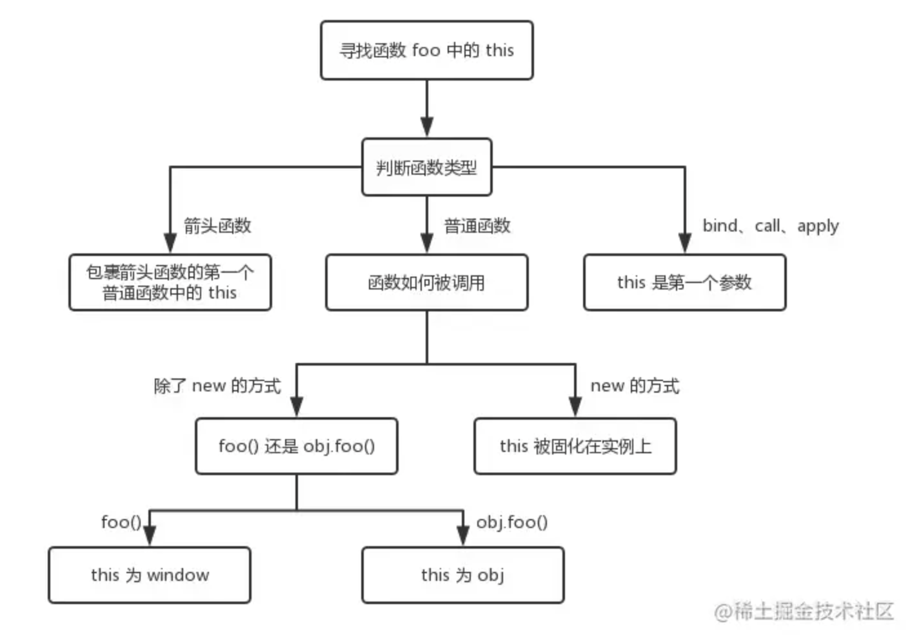

# 函数

## this指向
  * `普通函数`调用: 指向全局对象-`window`、node里面没有window 对象，浏览器中有window对象
  * `对象函数`调用：这个相信不难理解，就是哪个函数调用，this指向哪里、哪个对象调用函数，函数里面的this指向哪个对象。
  * `构造函数`调用： Call、apply、bind 三种改变this指向的方法、`this 指向你传递给 call、apply 或 bind 的第一个参数`
  * 每个函数都包含两个非继承而来的方法：call()方法和apply()方法。
  * `箭头函数调用`：在箭头函数里面，没有 this ，箭头函数里面的 this 是继承外面的环境。
  

* `箭头函数和普通函数的区别`
  * 箭头函数样式上不一样，不需要function 字段来定义函数
  * this指向不同，会捕获自己所在上下文的this 值，作为自己的this值。定义的时候就确定固定了
  * 箭头函数不能作为构造函数使用，也不能使用new 关键字（箭头函数没有自己的this,它的this是继承外面的环境的this,且this指向永远不会改变，做为构造函数的话，this 要指向创建的新对象的）
  * 箭头函数没有自己的arguments，在箭头函数中访问arguments实际上获得的是外层局部（函数）执行环境的值
  * call, apply, bind 方法不适用于箭头函数，因为箭头函数没有自己的this，不能通过这些方法改变this指向
  * 箭头函数没有原型prototype属性，不能使用 instanceof 操作符
  * 箭头函数不能当作Generator函数使用，不能使用yield关键字，不能在函数体内使用yield关键字，不能使用yield* 展开参数 （Generator 函数非常适合处理大数据流和需要延迟计算的场景、延迟计算、状态保存、内存友好）

* `生成器函数：`
* function* 声明：用于定义生成器函数。
* yield 表达式：用于生成值和暂停函数执行。
* next() 方法：用于恢复函数执行，并返回 yield 生成的值。
* return 和 throw：生成器函数也可以返回值或抛出异常，控制生成器的终止。

```javascript
function* generatorExample() {
  yield 1;
  yield 2;
  yield 3;
}

// 使用生成器
const gen = generatorExample();

console.log(gen.next().value); // 1
console.log(gen.next().value); // 2
console.log(gen.next().value); // 3
console.log(gen.next().value); // undefined
```

* `构造函数：`
构造函数（constructor function）是用于创建对象的函数。在 JavaScript 中，构造函数通常与类（class）一起使用，用于初始化对象的属性和方法。

特点
`函数名首字母大写`：传统上，构造函数的名称首字母大写，以便与普通函数区分。
`使用 new 关键字`：构造函数通常与 new 关键字一起使用来创建新对象。
`初始化对象`：构造函数可以初始化对象的属性，并可以定义方法。

```javascript
// 构造函数定义
function Person(name, age) {
  this.name = name;
  this.age = age;
}

// 创建对象
const person1 = new Person('Alice', 30);
console.log(person1.name); // Alice
console.log(person1.age);  // 30


// 构造函数也可以定义在类中

// * 类的使用提供了更清晰的语法和结构，支持继承和多态，简化了对象创建和管理的过程。
// * 它们增强了 JavaScript 的面向对象编程能力，使代码更易于理解、维护和扩展
class Person {
  constructor(name, age) {
    this.name = name;
    this.age = age;
  }
}

// 创建对象
const person1 = new Person('Alice', 30);
console.log(person1.name); // Alice
console.log(person1.age);  // 30
```

* `高阶函数：`
  * 接受一个或多个函数作为参数。
  * 返回一个函数作为结果
  * 高阶函数在函数式编程中非常有用，可以帮助我们编写更简洁、更易于理解和维护的代码。
  

* `防抖截流区别`
  * 防抖： 防止人抖动、点击按钮操作、一段时间内不会执行这个操作，防止误操作（多次执行变为最后一次执行）
  * 截流： 鼠标移动/滚动、窗口变化、每隔一段时间就执行一次函数，而不管事件触发的频率有多高 （多次执行变为每隔一段时间执行）
  

